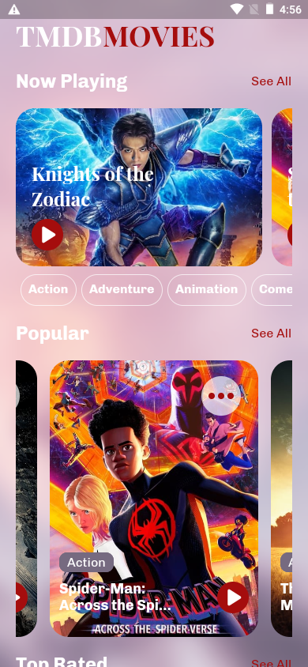
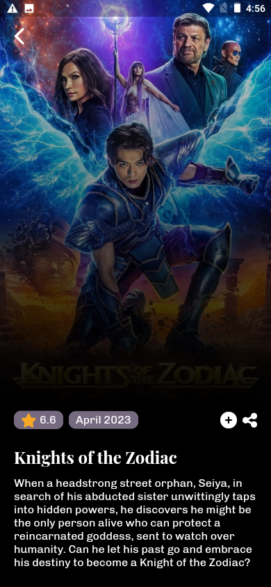

# TMDB MOVIES APP

A Flutter app that showcases the latest movies, popular movies, top-rated movies, and movie details using the TMDB API.

## Screenshots

  

  

## Features

- Browse Now Playing movies: Get a list of the currently playing movies, including release date, overview, and poster image.
- Explore Popular movies: Discover the most popular movies, along with their ratings and genres.
- Discover Top Rated movies: Explore the top-rated movies based on user ratings.
- Movie Details: View detailed information about a specific movie, including overview and user rating.

## Getting Started

A few resources to get you started if this is your first Flutter project:

- [Lab: Write your first Flutter app](https://docs.flutter.dev/get-started/codelab)
- [Cookbook: Useful Flutter samples](https://docs.flutter.dev/cookbook)

For help getting started with Flutter development, view the
[online documentation](https://docs.flutter.dev/), which offers tutorials,
samples, guidance on mobile development, and a full API reference.
